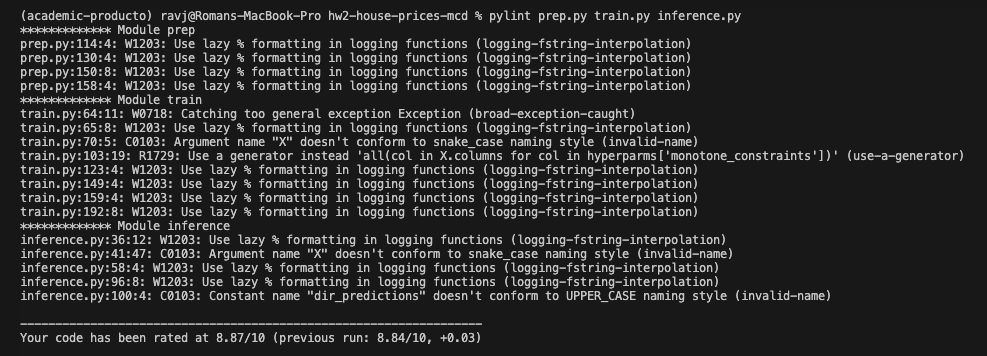
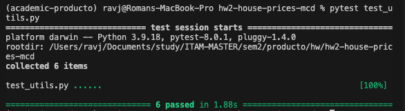

# house-prices-mcd :house_with_garden:
Homework for product architecture. The repo creates an interface where the user can value a house from the Ames Housing dataset. This data is only for simulation purposes. The idea is to generate a ML product that can predict the price of a house based on the following features:

`Variables` 
1. `Lot Area` in square feet
2. `Built Area` in square feet
3. `Age of the house` in years (the last time it was built or renovated)
4. `Overall Condition`: rates the overall material and finish of the housefrom from 1 to 10
5. `Overall Quality`: rates the overall condition of the house from 1 to 10
6. `MSZoning`: The general zoning classification (only residential houses):
    - RL: Residential Low Density
    - RM: Residential Medium Density
    - RH: Residential High Density


# How to use it :question: :computer:
## Source :file_folder:
The source code is divided into the following files:
1. `prep.py`: this file does the ETL of the data saved in the `data/raw` folder and saves the data in the `data/clean` folder. To run the file, run the following command in your terminal:
```bash
cd source
python prep.py
```

2. `train.py`: this file trains the model and saves the model in the `models` folder. To run the file, run the following command in your terminal:
```bash
cd source
python train.py
```

3. `inference.py`: this file predicts the price of a house based on the input of the user. The script has two flags:
    - `--csv_file`: the path of the csv file with the input of the user. The file should have the following columns: `CurrentAge`, `GrLivArea`, `LotArea`, `OverallCond`, `OverallQual`, `MSZoning`.
    - `--evaluate`: if the flag is present and set to `True`, the script will also print the RMSE, MAPE and $R^2$ of the model. The default value is `False`.
To run the file, run the following command in your terminal:
```bash
cd source
python inference.py --csv_file path_to_csv_file --evaluate [True|False]
```

4. `source/utils.py`: this file contains the functions used in the other files.

5. `test_utils.py`: this file contains the tests of the functions in the `utils.py` file. To run the tests, run the following command in your terminal:
```bash
python test_utils.py
```

## Notebooks :notebook:
The notebooks are in the `notebooks` folder. The notebooks should be run in the following order:
1. `eda.ipynb`: This notebook contains the exploratory data analysis of the dataset. It also contains the feature engineering and the feature selection.
2. `model.ipynb`: This notebook contains the model training and the model evaluation.
3. `model_no_log.ipynb`: This notebook contains the model training and the model evaluation without the log transformation of the target variable.
4. The demo notebook called `demo.ipynb`. The demo does the following:
    1. Predict the price of a house based on the input of the user.
    2. Explain the prediction of the model using SHAP values in a waterfall plot.

The payload of the model is the following:
```python
data = {
    'CurrentAge': 20, # Current age of the house
    'GrLivArea': 1000, # Above grade (ground) living area square feet
    'LotArea': 1000, # Lot size in square feet
    'OverallCond': 5, # Overall condition rating, from 1 to 10
    'OverallQual': 5, # Overall material and finish quality, from 1 to 10
    'MSZoning': 'RL' # Zoning classification
}
```

# Repo structure :open_file_folder:
The repo has the following structure:
```
.
├── LICENSE
├── README.md
├── data
│   ├── clean
│   ├── predictions
│   └── raw
├── models
│   └── vanilla_catboost
├── notebooks
│   ├── demo.ipynb
│   ├── eda.ipynb
│   ├── models.ipynb
│   └── models_no_log.ipynb
├── requirements.txt
└── source
    └── utils.py
└── prep.py
└── train.py
└── inference.py
└── test_utils.py
```


# Caveats :warning:
## Scope of the MVP
The MVP only works for:

- Houses
- Normal Sale Condition or Partial Sale Condition which means it was a presale. (not foreclosure, not short sale, etc.)
- Residential houses (no commercial, no industrial, etc.)
- Warranty Convencional or New Home (no VA, no FHA, etc.)

## Linter Grade
The linter grade is `8.84` according to the `pylint` package. 


## Test Grade
The pytest grade is `100%` according to the `pytest` package.



# Requirements :clipboard:
The requirements are in the `requirements.txt` file. To install them, run the following command in your terminal:
```bash
pip install -r requirements.txt
```

The python version used is `3.9`.